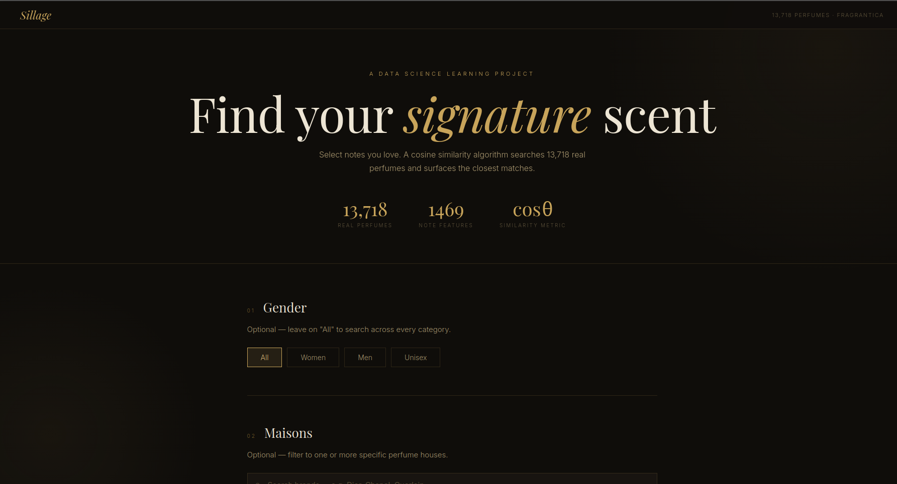
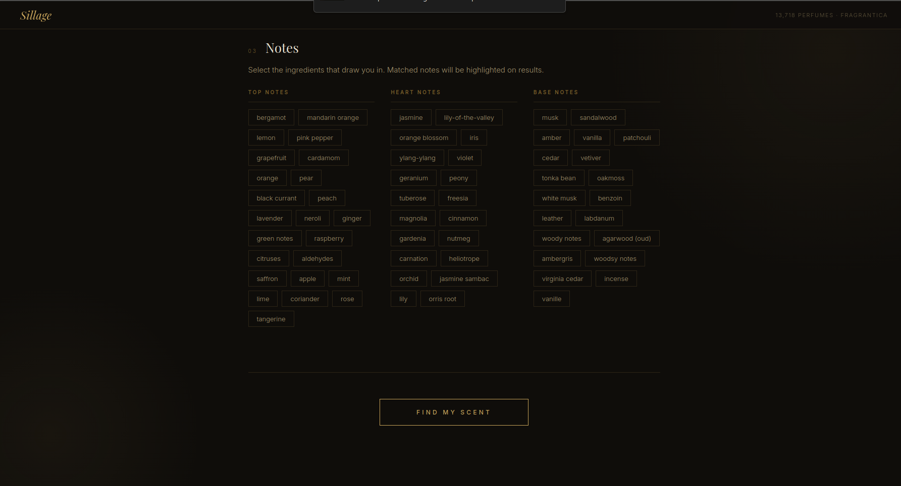
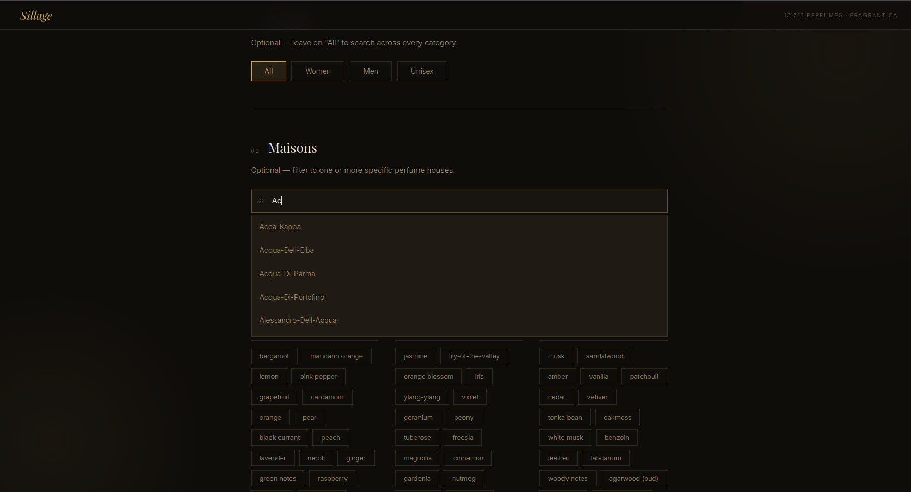
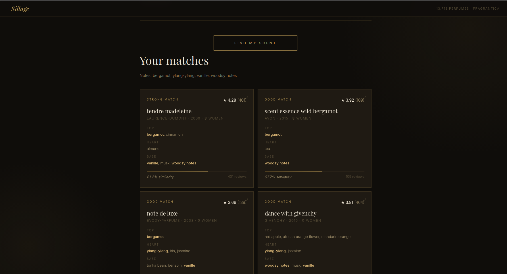

# Sillage — Perfume Recommender

A content-based recommendation system built around a personal passion for fragrance.
Given a set of fragrance notes, the app searches 13,718 real perfumes from the
Fragrantica dataset and surfaces the closest matches using cosine similarity.

---

## Demo









---

## Motivation

This is my first data science project. Rather than follow a generic tutorial,
I wanted to learn by building something I genuinely cared about — so I picked
perfumery, a personal passion of mine. The dataset, the problem, and the output
all felt real, which made every concept stick: cleaning messy data, encoding
text as numbers, measuring similarity mathematically. The project was the
curriculum.

---

## How It Works

```
CSV  →  pandas (clean)  →  MultiLabelBinarizer (encode)  →  cosine_similarity  →  Flask API  →  browser
```

1. **Load** — `pandas.read_csv()` ingests the raw CSV (semicolon-separated, European decimals)
2. **Clean** — rename columns, fix types, filter to ≥100 reviews, parse note strings into lists
3. **Encode** — `MultiLabelBinarizer` turns each perfume's notes into a binary vector of 1,469 dimensions
4. **Score** — `sklearn.metrics.pairwise.cosine_similarity` computes the angle between the user vector and all 13,718 perfume vectors
5. **Serve** — Flask exposes a `/api/recommend` endpoint; the frontend POSTs preferences and renders results

---

## Stack

| Layer       | Technology                            |
|-------------|---------------------------------------|
| Backend     | Python, Flask                         |
| ML / Data   | pandas, scikit-learn, NumPy           |
| Frontend    | HTML, CSS, Vanilla JS                 |
| Dataset     | Fragrantica via Kaggle (24k perfumes) |

---

## Features

- Note-based filtering across top, heart, and base tiers
- Gender filter and multi-brand combobox selector
- Matched notes highlighted on each result card
- One-click link to every perfume's Fragrantica page
- Matrix cached with `@lru_cache` — built once on startup, instant on every query

---

## Setup

```bash
# 1. Clone or unzip the project
# 2. Download fra_cleaned.csv from Kaggle and place it in the root folder
#    https://www.kaggle.com/datasets/olgagmiufana1/fragrantica-com-fragrance-dataset

pip install -r requirements.txt
python app.py
# → http://localhost:5000
```

---

## Project Structure

```
sillage/
├── app.py            Flask server and API routes
├── data.py           Data loading and preprocessing
├── recommender.py    Encoding + cosine similarity pipeline
├── fra_cleaned.csv   Raw dataset (download separately)
├── assets/           Demo screenshots
└── templates/
    └── index.html    Frontend
```

---

## Dataset

[Fragrantica Dataset — Kaggle](https://www.kaggle.com/datasets/olgagmiufana1/fragrantica-com-fragrance-dataset)
· 24,063 entries · filtered to 13,718 (≥100 reviews) · 1,469 unique notes